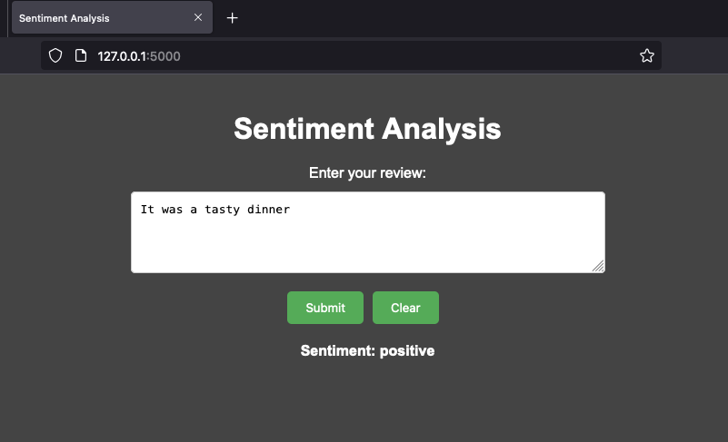

# Sentiment Analysis Web Application

This is a web application for sentiment analysis using a pre-trained BERT model. The application allows users to input a review and get the sentiment (positive or negative) as a result.



## Prerequisites

- Python 3.12.4
- Flask 3.0.3
- PyTorch .2.2
- Transformers 4.45.2
- sklearn 1.5.2
- numpy 1.26.0

## Setup

1. **Clone the repository:**

    ```sh
    git clone git@github.com:amirhkr/Sentiment_Analysis.git
    cd Sentiment_Analysis
    ```

2. **Create a virtual environment:**

    ```sh
    python -m venv venv
    ```

3. **Activate the virtual environment:**

    - On Windows:

        ```sh
        venv\Scripts\activate
        ```

    - On macOS/Linux:

        ```sh
        source venv/bin/activate
        ```

4. **Install the required packages:**

    ```sh
    pip install -r requirements.txt
      ```

## Note: The pre-trained model verification

Ensure that the  pre-trained model is in this path <em>/model/model.pth</em>once the repo is cloned. If not, download it and place it there.

Alternatively,you may want run <em>training.ipynb</em> Jupter notebook using the same virtual enviroment created above to train a new model which may take some time!

## Running the Application

1. **Start the Flask application:**

    ```sh
    python app.py
    ```

2. **Open your web browser and navigate to:**

    ```
    http://127.0.0.1:5000/
    ```

3. **Use the application:**

    - Enter a review in the input field.
    - Click the "Submit" button.
    - The sentiment of the review will be displayed on the page.

## Project Structure

- `app.py`: Main application file containing the Flask app and sentiment prediction logic.
- `templates/index.html`: HTML template for the web interface.
- `model/model.pth`: Pre-trained BERT model for sentiment analysis.
- `requirements.txt`: List of required Python packages.

## License

This project is licensed under the MIT License.